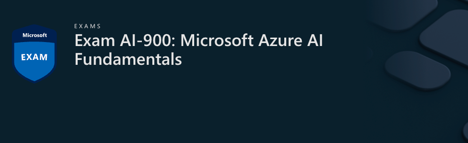
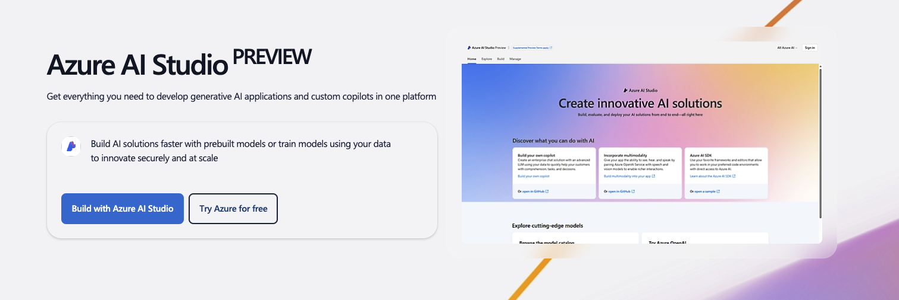

# AI-900 Projects

This is repository of projects I have created during preparation of [Azure AI 900 certification exam](https://learn.microsoft.com/en-us/credentials/certifications/exams/ai-900/); I created some projects here with real world use case examples

## Description

### What are Azure AI services?

Azure AI Services are collection of AI capabilities provided by Azure, such as

- Translation
- Speech to Text and Text to Speech
- Vision and Face Recognition
- Content Safety and Moderation
- Document Intelligence and Copilot

Find out more at [Azure AI Studio](https://azure.microsoft.com/en-us/products/ai-studio)

#### License

This demo is licensed under MIT license and available for free 