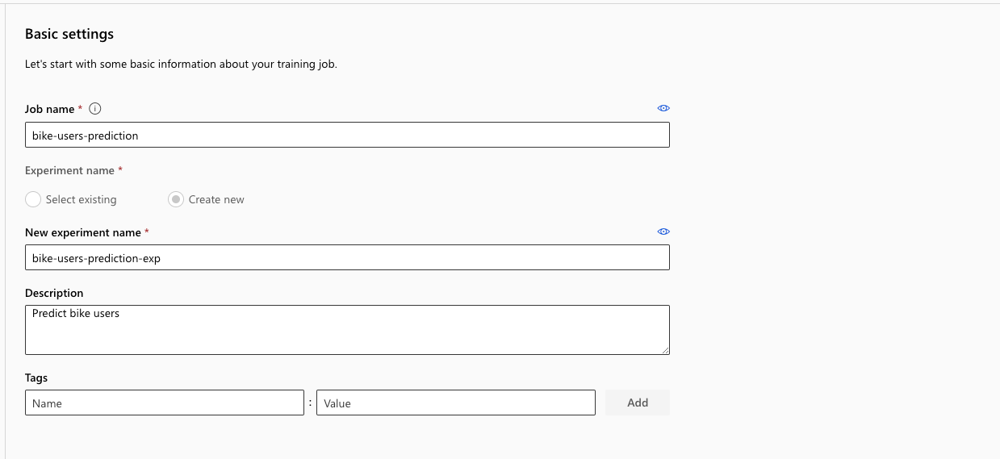
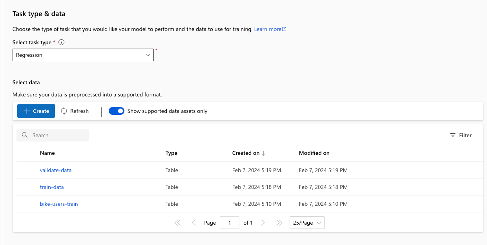
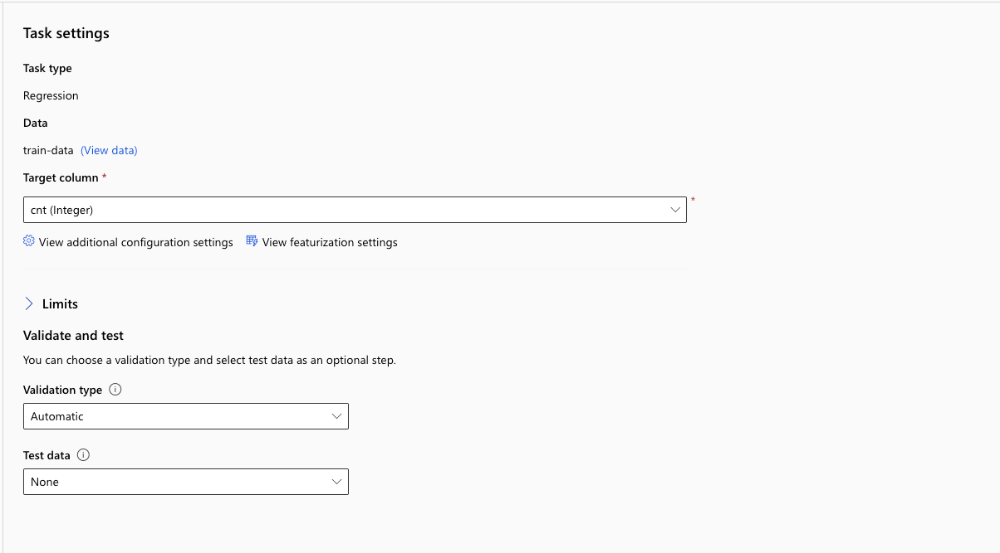
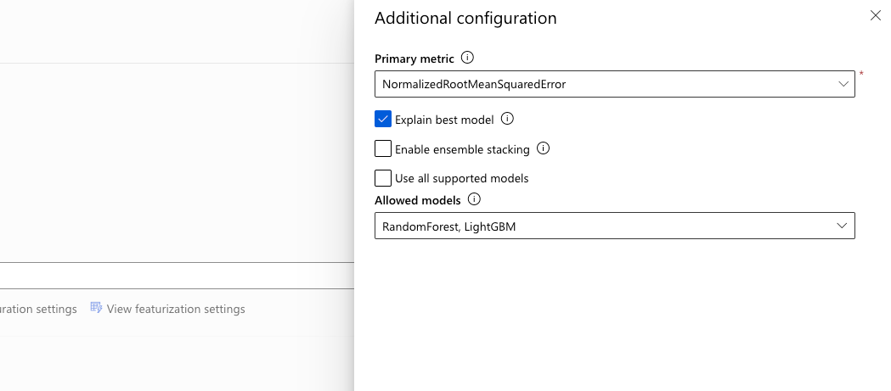
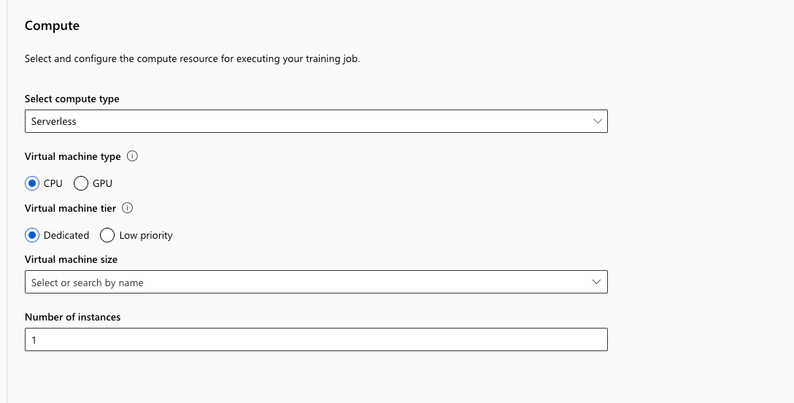
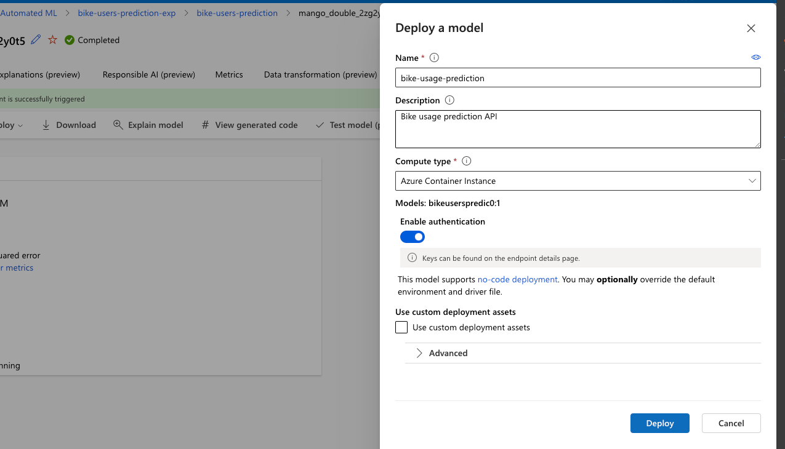
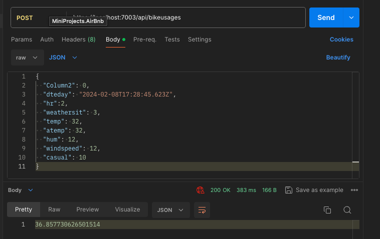

# Bike Users

### Introduction

This is demo of using Regression Machine Learning model with Azure Machine Learning Studio and utilizing using local Web API with Asp.NET Core

### Getting started

#### Requirements

- Basic knowledge of C# and Asp.NET Core
- Basic knowledge of Web API development
- Understanding fundamental concepts of Machine Learning

### System Requirements

- .NET 8 SDK
- Any IDE that supports C# ( VS 2022, Rider or VS Code )

### Problem 

Given the bike usage dataset with following features, predict the bike usage for given 

- `dteday` - Date
- `hr` - hours
- `weathersit` - Weather 
  1. Clear, Few clouds, Partly cloudy
  2. Mist + Cloudy, Mist + Broken clouds, Mist + Few clouds, Mist
  3. Light Snow, Light Rain + Thunderstorm + Scattered clouds, Light Rain + Scattered clouds
  4. Heavy Rain + Ice Pallets + Thunderstorm + Mist, Snow + Fog
- `temp` - Normalized temperature in Celsius
- `atemp` - Normalized feeling temperature in Celsius
- `hum` -  Normalized humidity
- `windspeed` - Normalized wind speed
- `casual` - Count of casual users

### Solution plan

- Create and train ML model
- Deploy ML model as web service
- Create local Web API and integrate with Web Service

### Creating ML Model step by step

- Open [Azure Machine Learning Studio](https://ml.azure.com/home)
- Go to `Worksapces` tab and press `New`
- Enter workspace name and choose resource group, subscription and region
- Create workspace and open it
- Go to `Automated ML` tab and press `New Automated ML Job`

#### Basic Settings

- Enter name, description for job

#### Task type & date

- Open Task & Type and choose `Regression`
- Press create data
- Add name, description for data and choose type `Tabular`
- Choose from local files and upload `train.csv`
- Choose delimited file format at settings

#### Task settings

- Choose target column as `cnt`
- Choose limits as 
  1. Max trials - 3
  2. Max concurrent tasks - 3
  3. Max nodes - 3
  4. Max score threshold - 0.085
  5. Experiment timeout - 15
  6. Iteration timeout - 15
  7. Enable early termination - true

#### Additional settings

- Open additional settings
- Disable "Use all supported models" and "Enable ensemble stacking"
- Choose `RandomForest` and `LightGBM` models

#### Compute

- Choose Serverless CPU compute with instance `Standard DS3 v2` with 1 instance
- Submit training data

In my example it took 14 minutes

### Deploying ML model

- After job is finished open best model on the right side
- Press Deploy and choose Web Service
- Choose Azure Container Instance for Compute type
- Enable authentication and deploy

#### Testing the endpoint

- Open Endpoints tab and open Test section
- 

### Creating Web API

- Create Web API in Asp.NET Core using empty template
- Install `Azure.ResourceManager.MachineLearning` library
- Add broker for Azure ML endpoint
- Register broker and create endpoints
- Configure Web API

Result : 

#### License

This demo is licensed under MIT license and available for free