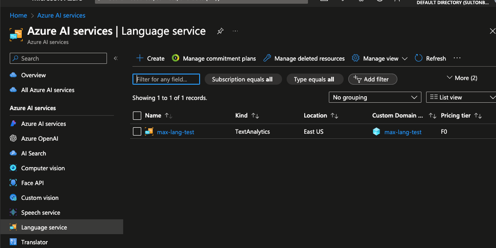
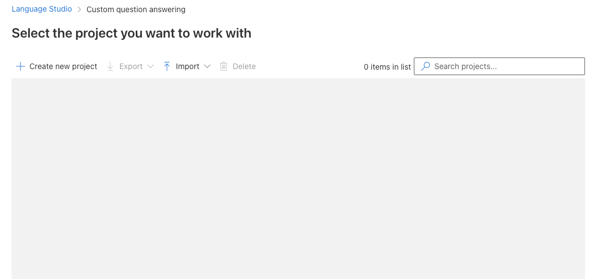
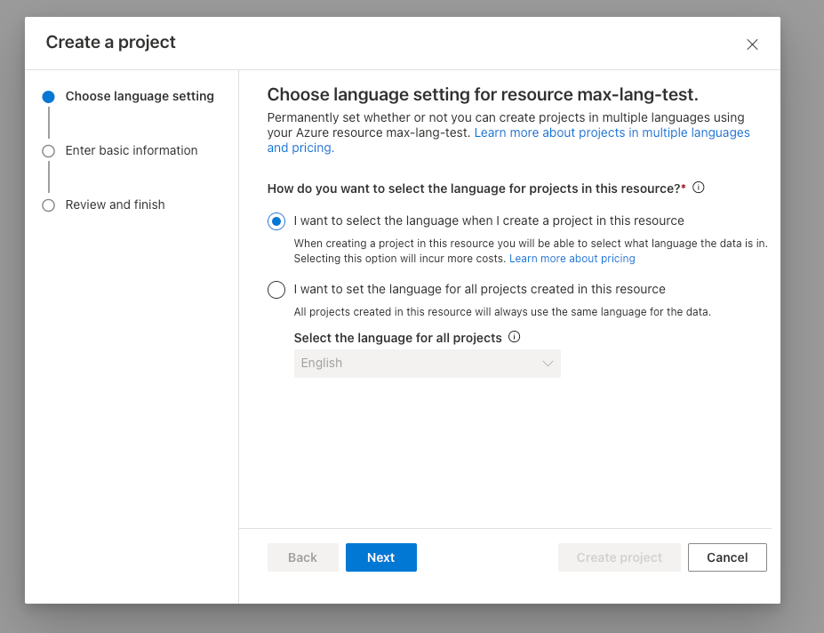
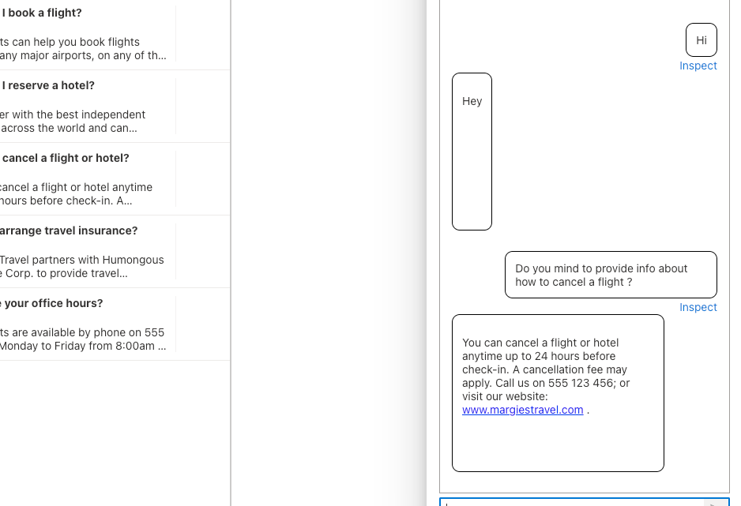
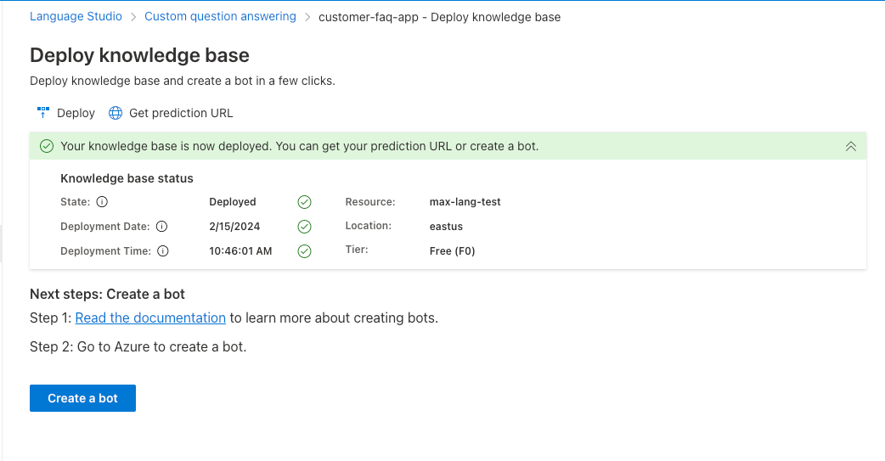
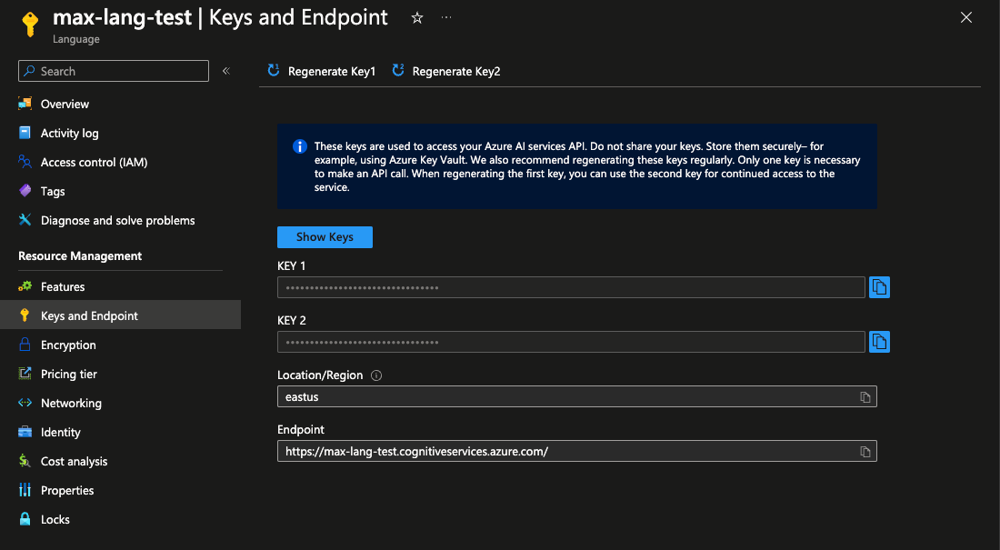

### Introduction

This is demo of using Azure AI Language Services to integrate it to customer service

### Getting started

#### Requirements

- Basic knowledge of C# and Asp.NET Core
- Basic knowledge of Web API development
- Basic knowledge of Azure Cloud Services

### System Requirements

- .NET 8 SDK
- Any IDE that supports C# ( VS 2022, Rider or VS Code )

### Problem

We have Customer F&Q or Forum app, problem is customers need answers without advanced searching duplicate question.

### Solution plan

We can solve this using Custom Question Answering feature of Language Services. We create that service, chain with Azure Search and create Bot Service to receive requests

#### Create Language Service



- Open Azure AI Services - https://portal.azure.com/#view/Microsoft_Azure_ProjectOxford/CognitiveServicesHub/~/AIServices
- Open Language Service tab
- Click Create resource, choose subscription and resource group

#### Checkout resources in Language Studio



- Open Vision Studio - https://language.cognitive.azure.com/home
- Go to Custom Question Answering tab
- Click "Create new project"
- Choose Language resource and create free Azure Search resource

#### Creating project



- Select "I want to select language when I create project in this resource"
- Add basic name, description and choose language and default answer
- Go to sources and add [this](https://view.officeapps.live.com/op/view.aspx?src=https%3A%2F%2Fraw.githubusercontent.com%2FMicrosoftLearning%2Fmslearn-ai-fundamentals%2Fmain%2Fdata%2Fnatural-language%2Fmargies_faq.docx&wdOrigin=BROWSELINK) source as URL
- Once added, you can edit or add question/answer pairs in "Edit knowledge base" tab

#### Testing knowledge base



- Open "Edit knowledge base"
- Click "Test" icon
- Enter some relevant questions and check answers

#### Deploying knowledge base



- Open "Deploy knowledge base" tab
- Click "Deploy"

#### Get endpoint and keys



- Go back to Azure AI Services -> Language Service
- Open the resource you created
- Open Keys and endpoints
- Copy key and endpoint here

### Creating Web API

- Create Web API in Asp.NET Core using empty template
- Add knowledge base broker and service
- Configure Web API

### Example requests

#### Asking for existing question

Result : 

```json
{
  "question": "How about cancelling a flight ?"
}
```

```json
{
  "answer": "You can cancel a flight or hotel anytime up to 24 hours before check-in. A cancellation fee may apply. Call us on 555 123 456; or visit our website: [www.margiestravel.com](http://www.margiestravel.com) .",
  "source": "https://raw.githubusercontent.com/MicrosoftLearning/mslearn-ai-fundamentals/main/data/natural-language/margies_faq.docx",
  "isFound": true
}
```

#### Asking for non-existing question

```json
{
  "question": "How to create http client ?"
}
```

```json
{
  "answer": "No answer found",
  "source": null,
  "isFound": false
}
```