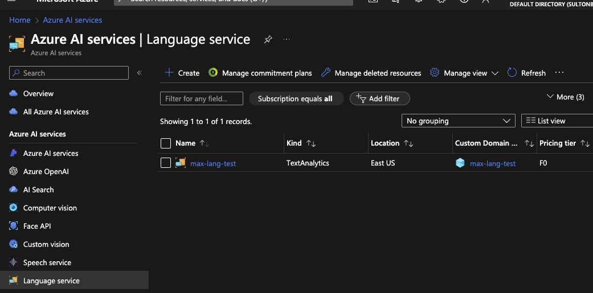
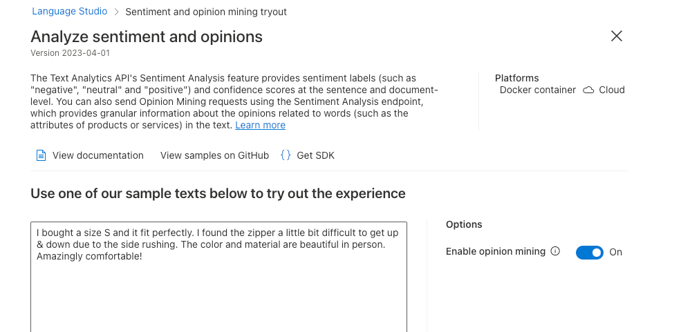
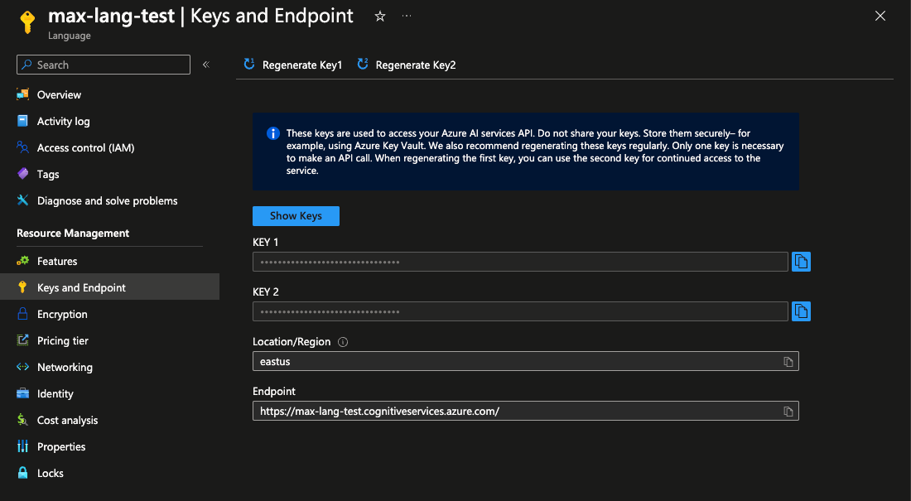

### Introduction

This is demo of using Azure Language Service ce to integrate it to feedback system to automate feedback relativity check, removing personal information and calculating feedback rating

### Getting started

#### Requirements

- Basic knowledge of C# and Asp.NET Core
- Basic knowledge of Web API development
- Basic knowledge of Azure Cloud Services

### System Requirements

- .NET 8 SDK
- Any IDE that supports C# ( VS 2022, Rider or VS Code )

### Problem

We have feedback system that enables users to just add their comments, but calculating rating score and redacting needs to be added in order to allow only related feedbacks and optimize scoring

### Solution plan

#### Create Multi-Service Resource

Single service resource is also fine



- Open Azure AI Services - https://portal.azure.com/#view/Microsoft_Azure_ProjectOxford/CognitiveServicesHub/~/AIServices
- Open Language service
- Click Create resource, choose subscription and resource group

#### Checkout resources in Azure Language Studio



- Open Language Studio - https://portal.vision.cognitive.azure.com/gallery/featured
- Choose resource you created
- Open "Classify text" and "Analyze sentiment and mine opinions"
- Check out how feature works

#### Get endpoint and keys



- Go back to Azure AI Services -> Language Service
- Open the resource you created
- Open Keys and endpoints
- Copy key and endpoint here

### Creating Web API

- Create Web API in Asp.NET Core using empty template
- Install `Azure.AI.TextAnalytics` library
- Create text analysis API broker
- Create rating processing service
- Create mappers between Text analysis result -> Rating
- Register all brokers to infrastructure and configure web API

#### Example requests

Text sentiment results :

Neutral = 0
Negative = 1
Positive = 2

#### Checking feedback analysis

#### Negative feedback

```json
{
  "userName": "John",
  "comment": "Last night, my friend Bill and I decided to try out the new Italian restaurant downtown, and unfortunately, our experience was far from pleasant. The moment we walked in, the atmosphere felt unwelcoming, and it took ages for someone to attend to us. When our food finally arrived, it was lukewarm at best, and my pasta was undercooked. Surprisingly, the dessert was the only saving grace of the evening, with the tiramisu being genuinely delicious and well-prepared. To top it off, payment didn’t work with my Central Bank Visa card, which caused an unnecessary delay. Le service était incroyablement lent"
}
```

Result :

```json
{
  "userName": "John",
  "comment": "Last night, my friend Bill and I decided to try out the new Italian restaurant downtown, and unfortunately, our experience was far from pleasant. The moment we walked in, the atmosphere felt unwelcoming, and it took ages for someone to attend to us. When our food finally arrived, it was lukewarm at best, and my pasta was undercooked. Surprisingly, the dessert was the only saving grace of the evening, with the tiramisu being genuinely delicious and well-prepared. To top it off, payment didn’t work with my Central Bank Visa card, which caused an unnecessary delay. Le service était incroyablement lent",
  "language": "English",
  "keyPhrases": [
    "Central Bank Visa card",
    "new Italian restaurant",
    "saving grace",
    "unnecessary delay",
    "friend",
    "Bill",
    "experience",
    "atmosphere",
    "ages",
    "someone",
    "food",
    "pasta",
    "dessert",
    "evening",
    "tiramisu",
    "payment",
    "service"
  ],
  "redactedComment": "Last night, my ****** **** and I decided to try out the new Italian restaurant downtown, and unfortunately, our experience was far from pleasant. The moment we walked in, the atmosphere felt unwelcoming, and it took ages for someone to attend to us. When our food finally arrived, it was lukewarm at best, and my pasta was undercooked. Surprisingly, the dessert was the only saving grace of the evening, with the tiramisu being genuinely delicious and well-prepared. To top it off, payment didn’t work with my ************ Visa card, which caused an unnecessary delay. Le service était incroyablement lent",
  "calculatingRating": 1.4312,
  "ratingSentiment": 1
}
```

#### Positive feedback

```json
{
  "userName": "John",
  "comment": "Last weekend, I celebrated my anniversary at Bella’s Kitchen, and it was an experience to remember. From the moment my partner and I entered, we were greeted with warm smiles and seated at a beautifully set table overlooking the city lights. The chef surprised us with a complimentary appetizer, a delightful bruschetta that set a high bar for what was to come. Each dish, from the succulent roasted chicken to the perfectly al dente pasta, was a testament to their commitment to quality and flavor. La comida estaba para chuparse los dedos,"
}
```

Result :

```json
{
  "userName": "John",
  "comment": "Last weekend, I celebrated my anniversary at Bella’s Kitchen, and it was an experience to remember. From the moment my partner and I entered, we were greeted with warm smiles and seated at a beautifully set table overlooking the city lights. The chef surprised us with a complimentary appetizer, a delightful bruschetta that set a high bar for what was to come. Each dish, from the succulent roasted chicken to the perfectly al dente pasta, was a testament to their commitment to quality and flavor. La comida estaba para chuparse los dedos,",
  "language": "English",
  "keyPhrases": [
    "succulent roasted chicken",
    "al dente pasta",
    "warm smiles",
    "city lights",
    "complimentary appetizer",
    "delightful bruschetta",
    "high bar",
    "anniversary",
    "Bella",
    "Kitchen",
    "experience",
    "moment",
    "partner",
    "table",
    "chef",
    "dish",
    "testament",
    "commitment",
    "quality",
    "flavor",
    "comida",
    "dedos"
  ],
  "redactedComment": "Last weekend, I celebrated my anniversary at Bella’s Kitchen, and it was an experience to remember. From the moment my ******* and I entered, we were greeted with warm smiles and seated at a beautifully set table overlooking the city lights. The **** surprised us with a complimentary appetizer, a delightful bruschetta that set a high bar for what was to come. Each dish, from the succulent roasted chicken to the perfectly al dente pasta, was a testament to their commitment to quality and flavor. La comida estaba para chuparse los dedos,",
  "calculatingRating": 3.9529,
  "ratingSentiment": 2
}
```