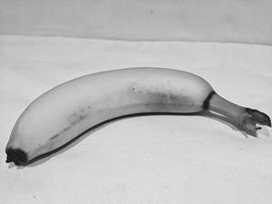
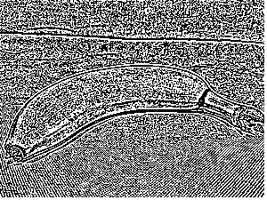

### Introduction

This is simple demo of applying filter to an image manually. You can find original details [here](https://learn.microsoft.com/en-us/training/modules/analyze-images-computer-vision/2-understand-computer-vision)

### Getting started

#### Requirements

- Basic knowledge of C# and Asp.NET Core
- Basic knowledge of image structure

### System Requirements

- .NET 8 SDK
- Any IDE that supports C# ( VS 2022, Rider or VS Code )

### Problem

Need to apply given filter to an image manually

### Solution plan

#### Load image

  

[//]: # ()

- Above is input image
- Install `SixLabors.ImageSharp` package
- Load image as `Rgba32` type `Image`

#### Apply filter and save image

  

- Above is expected result
- Create new image of `Rgba32` type `Image`
- Loop through image and apply filter and calculate sum of pixel
- Save image using that same type

This is result I got ( it's nowhere near to expected result 🤭)

  

