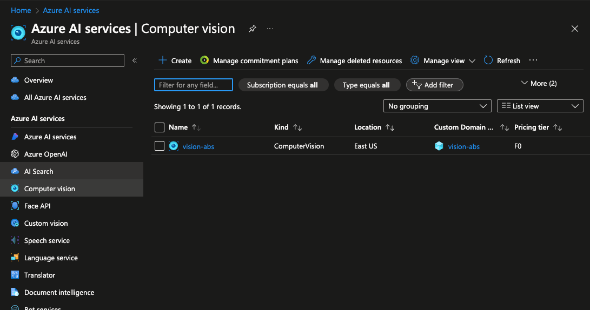
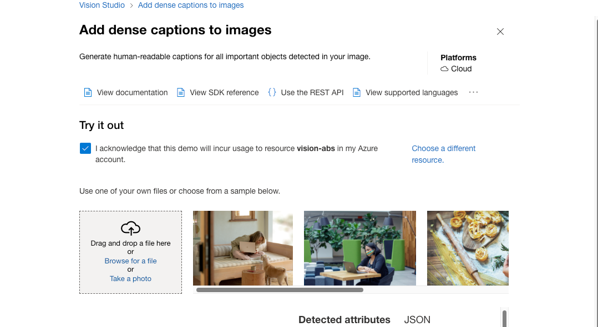
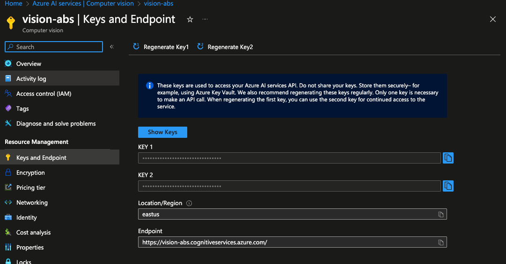

### Introduction

This is demo of using Azure AI Vision Studio to analyze uploaded image.

### Getting started

#### Requirements

- Basic knowledge of C# and Asp.NET Core
- Basic knowledge of Web API development
- Basic knowledge of Azure Cloud Services

### System Requirements

- .NET 8 SDK
- Any IDE that supports C# ( VS 2022, Rider or VS Code )

### Problem

You need to integrate image analysis into Warehouse API storage files infrastructure. This helps analyzing and generating captions for images for better search.

### Solution plan

#### Create Vision Resource



- Open Azure AI Services - https://portal.azure.com/#view/Microsoft_Azure_ProjectOxford/CognitiveServicesHub/~/AIServices
- Open Computer Vision tab
- Click Create resource, choose subscription and resource group

#### Checkout resources in Vision Studio



- Open Vision Studio - https://portal.vision.cognitive.azure.com/gallery/featured
- Choose resource you created
- Go to Image Analysis tab
- Click "Add dense captions to images" resource
- Upload an image or choose existing images and check results

#### Get endpoint and keys



- Go back to Azure AI Services -> Computer Vision
- Open the resource you created
- Open Keys and endpoints
- Copy key and endpoint here

### Creating Web API

- Create Web API in Asp.NET Core using empty template
- Install `Azure.AI.Vision.ImageAnalysis` library
- Create image upload service
- Create image analysis API client broker
- Use `ImageAnalysisClient` to upload and analyse images
- Store image metadata
- Configure Web API

#### Example requests

Store camera capturing consumers women and and girl checking products


Result : 

```json
[
  {
    "name": "files",
    "tags": [
      "a person and a child in a grocery store",
      "a person smiling while holding a phone",
      "a person holding a phone case",
      "a person wearing a purple hat",
      "a person holding a cell phone to a child in a store"
    ],
    "caption": "a person and a child in a grocery store"
  }
]
```