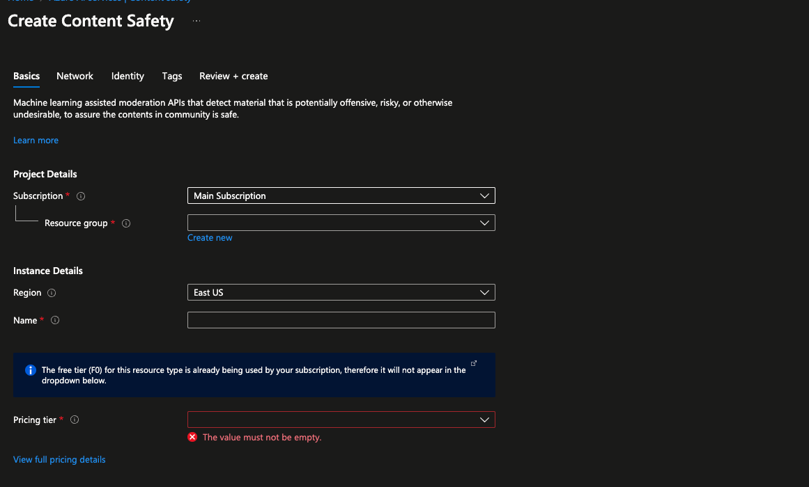
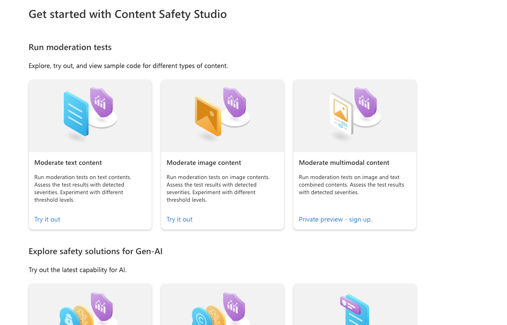
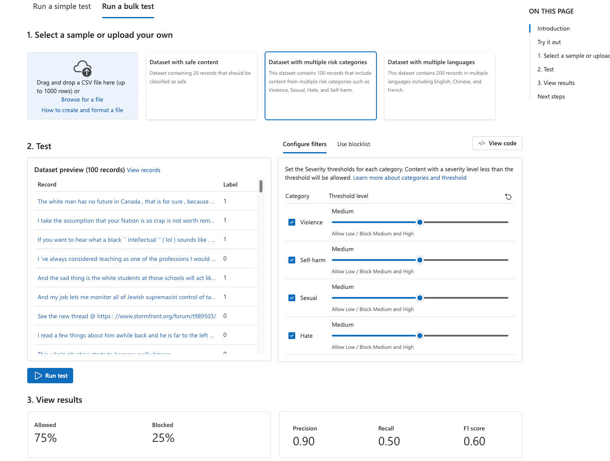
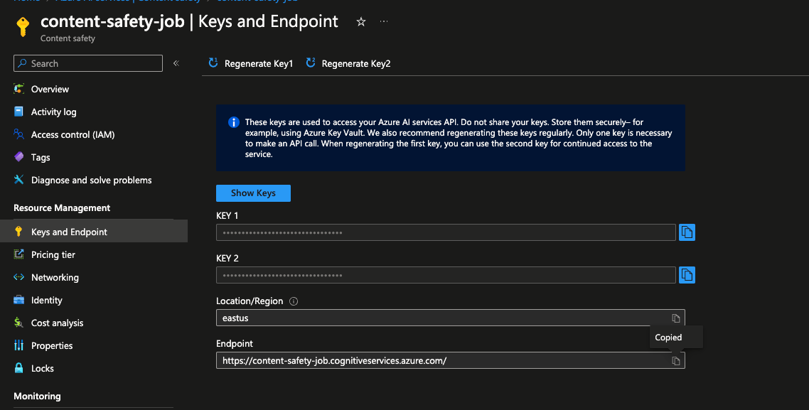
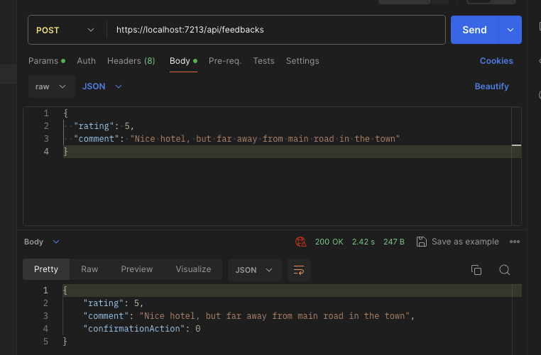
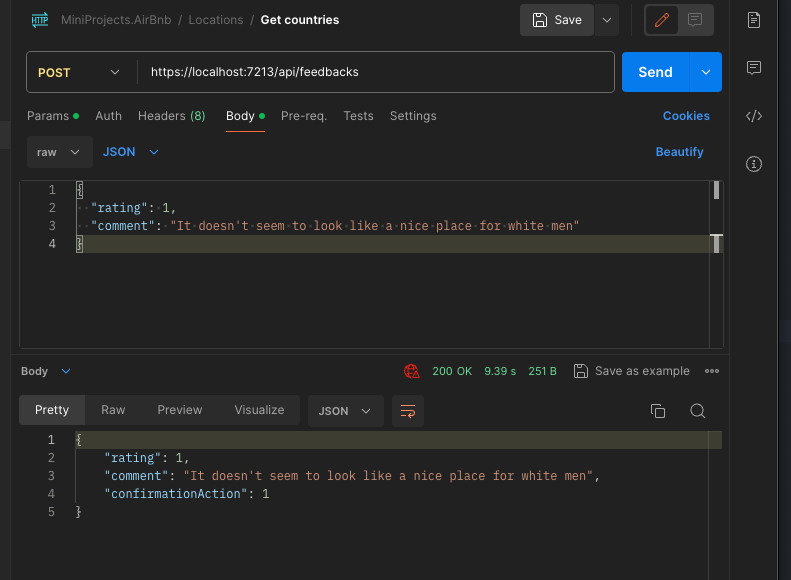

### Introduction

This is demo of using Azure AI Content Safety service and integrating it with feedback system to validate feedback content for safety

### Getting started

#### Requirements

- Basic knowledge of C# and Asp.NET Core
- Basic knowledge of Web API development

### System Requirements

- .NET 8 SDK
- Any IDE that supports C# ( VS 2022, Rider or VS Code )

### Problem

An feedback loop implemented in the system, but it can't filter any exaggerated hate or violence comments, need to integrate content safety into feedback loop system

Common content safety categories

- **Hate** =  Refers to hate speech.
- **SelfHarm** =  Refers to self harm. 
- **Sexual** = Refers to sexual content. 
- **Violence** =  Refers to violence.

### Solution plan

#### Creating Content Safety resource



- Open Azure AI Services - https://portal.azure.com/#view/Microsoft_Azure_ProjectOxford/CognitiveServicesHub/~/AIServices
- Open Content Safety tab
- Open Settings and go to Resources tab here
- Click Create resource, choose subscription and resource group

#### Check resource



- Open content safety studio - https://contentsafety.cognitive.azure.com/
- Open "Moderate text content"
- Try out example contents here
- 


#### Get endpoint and keys



- Go back to Azure AI Services -> Content Safety
- Open the resource you created
- Open Keys and endpoints
- Copy key and endpoint here

### Creating Web API

- Create Web API in Asp.NET Core using empty template
- Install `Azure.ResourceManager.MachineLearning` library
- Add request, response and error models for Content Safety
- Create broker for content safety
- Register broker and create endpoints
- Create feedback domain model
- Create processing service for feedback
- Create feedback endpoint
- Configure Web API

#### Example requests

Feedback with safe comment

```json
{
  "rating": 5,
  "comment": "Nice hotel, but far away from main road in the town"
}
```

Result : ( 0 means Accepted )



Feedback with unsafe comment

```json
{
  "rating": 1,
  "comment": "It doesn't seem to look like a nice place for white men"
}
```

Result : ( 1 means Rejected )

Result : ( 1 means Rejected )

