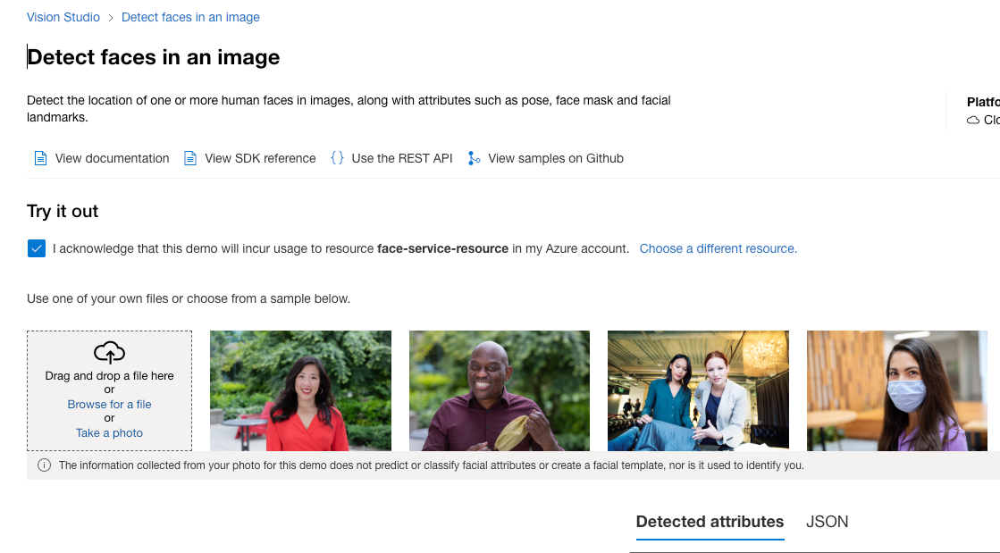
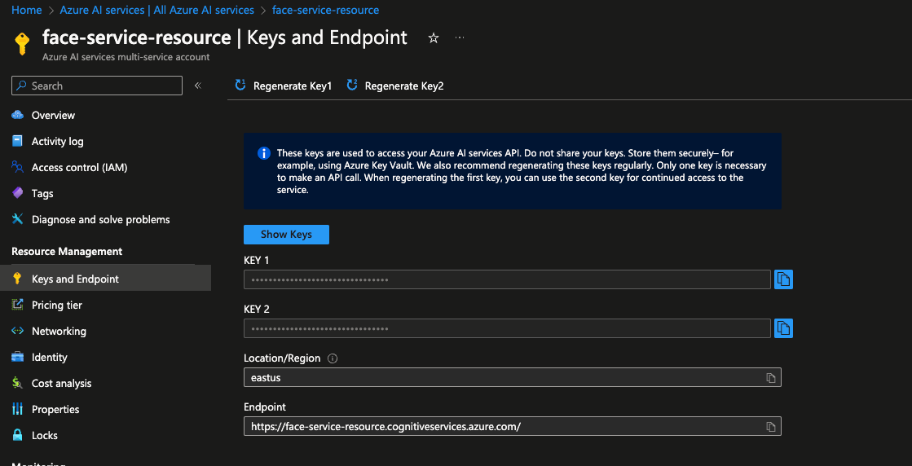

### Introduction

This is demo of using Azure Face Service to integrate it to identity infrastructure to validate user photo

### Getting started

#### Requirements

- Basic knowledge of C# and Asp.NET Core
- Basic knowledge of Web API development
- Basic knowledge of Azure Cloud Services

### System Requirements

- .NET 8 SDK
- Any IDE that supports C# ( VS 2022, Rider or VS Code )

### Problem

We have identity system that requires user uploaded photo to contain face and it has some requirements to validate the face in the image

### Solution plan

#### Create Multi-Service Resource

Single service resource is also fine


- Open Azure AI Services - https://portal.azure.com/#view/Microsoft_Azure_ProjectOxford/CognitiveServicesHub/~/AIServices
- Open Azure AI services multi-service account
- Click Create resource, choose subscription and resource group

#### Checkout resources in Vision Studio



- Open Vision Studio - https://portal.vision.cognitive.azure.com/gallery/featured
- Choose resource you created
- Open "Face" tab and "Detect faces in an image resource"
- Check out how feature works

#### Get endpoint and keys



- Go back to Azure AI Services -> Computer Vision
- Open the resource you created
- Open Keys and endpoints
- Copy key and endpoint here

### Creating Web API

- Create Web API in Asp.NET Core using empty template
- Install `Microsoft.Azure.CognitiveServices.Vision.Face` library
- Create image upload service
- Create face analysis API client
- Use `FaceClient` to upload and analyse faces in an image
- Store image metadata
- Configure Web API

#### Example requests

Result :

```json

```

Results : 

- Accessory from accessories.png - Accessory not detected ❌
- Bad quality from bad-quality.png - Face not detected ❌ ( retry )
- Head pose from head-pose.png - Face not detected ❌
- Multiple faces from multiple-faces.png - All faces are detected ✅
- Occlusion from occlusion.png - Face not detected ❌ ( retry )
- Overexposed - not detected