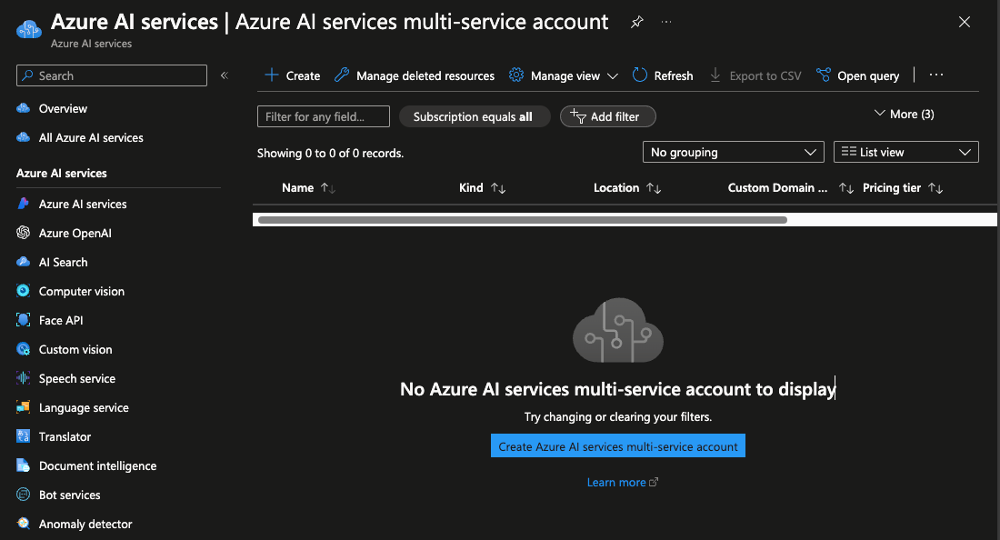
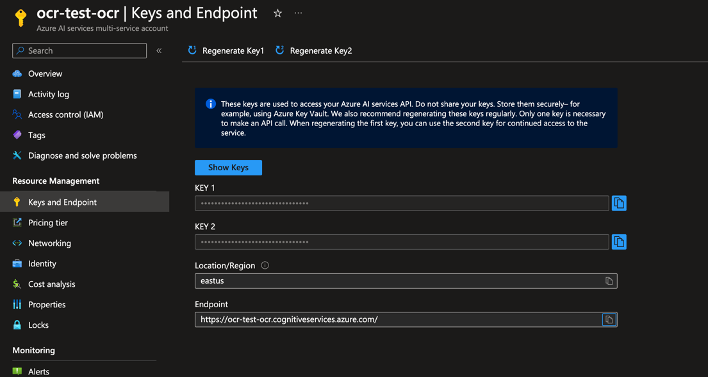

### Introduction

This is demo of using Azure Computer Vision Service to integrate it to Talent Management to use OCR capability.

### Getting started

#### Requirements

- Basic knowledge of C# and Asp.NET Core
- Basic knowledge of Web API development
- Basic knowledge of Azure Cloud Services

### System Requirements

- .NET 8 SDK
- Any IDE that supports C# ( VS 2022, Rider or VS Code )

### Problem

We have Talent Management system, but uploaded resume analysis isn't integrated, implement document OCR functionality to retrieve data from files

### Solution plan

OCR capability is accessed via `ComputerVisionClient` via Azure Computer Vision library. Image processing takes some time, so service returns operation location. With operation location we can later check operation status to see if processing is finished.

#### Create Multi-Service Resource

Single service resource is also fine



- Open Azure AI Services - https://portal.azure.com/#view/Microsoft_Azure_ProjectOxford/CognitiveServicesHub/~/AIServices
- Open Azure AI services multi-service account
- Click Create resource, choose subscription and resource group

#### Checkout resources in Vision Studio



- Open Vision Studio - https://portal.vision.cognitive.azure.com/gallery/featured
- Choose resource you created
- Open "Face" tab and "Detect faces in an image resource"
- Check out how feature works

#### Get endpoint and keys


- Go back to Azure AI Services -> Computer Vision
- Open the resource you created
- Open Keys and endpoints
- Copy key and endpoint here

### Creating Web API

- Create Web API in Asp.NET Core using empty template


- Install `Microsoft.Azure.CognitiveServices.Vision.ComputerVision` library
- Create file checksum provider to be able to calculate checksum of uploaded file
- Add memory cache and cache broker to get operation Id for past uploaded file
- Add document scanner broker for Cognitive Service endpoint
- Use `ComputerVisionClient` to upload and analyse images as documents
- Create resume service to upload files
- Register all brokers to infrastructure and configure web API

#### Example requests

Operation status codes : 

NotStarted = 0
Running = 1
Failed = 2
Succeeded = 3

#### Uploading resume document

Uploading `1.jpeg` image in Api -> Data -> Images

Result : 

```json
{
  "status": 1,
  "resumeContent": null
}
```

#### Checking result

Result : 

```json
{
  "status": 3,
  "resumeContent": [
    "January 23rd 2020",
    "For the attention of:",
    "The manager",
    "Northwind Traders",
    "123 Any Street",
    "Bellevue, WA",
    "Dear Sir or Madam,",
    "I am writing to thank you for the fantastic service I received at",
    "your store on January 20th. The store assistant who helped me was",
    "extremely pleasant and attentive; and took the time to find all of",
    "the fresh produce I needed.",
    "I've always found the quality of the produce in your store to be",
    "high, and the prices to be competitive; and the helpfulness of your",
    "employees is another reason I will continue to remain a loyal",
    "Northwind Traders customer.",
    "Sincerely,",
    "A Customer",
    "A. Customer"
  ]
}
```